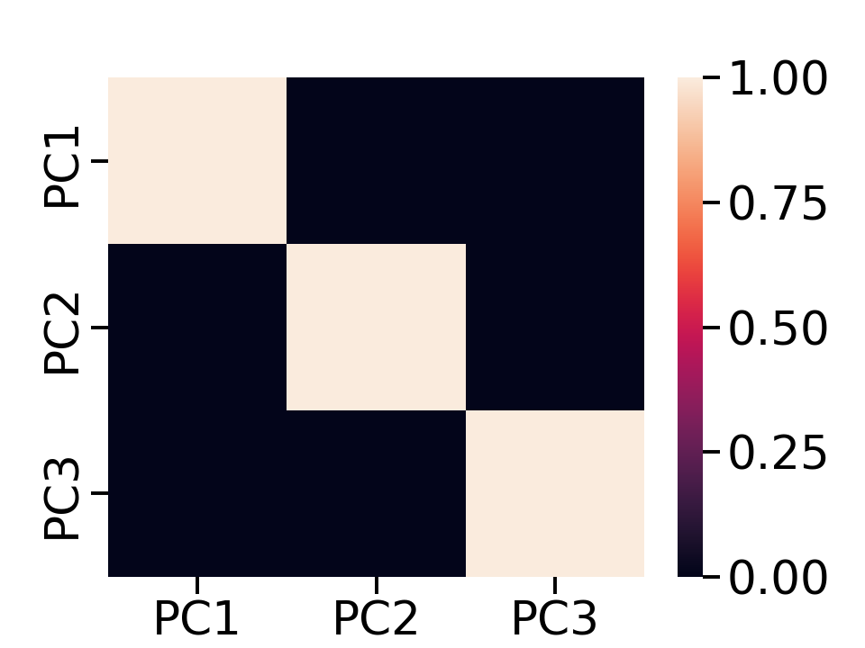

# Recommendation system for E-commerce
## Introduction
The rapid growth of e-commerce in recent years has transformed how consumers shop for and purchase electronic products. The extensive selection of electronics available online offers various benefits to consumers, including convenience, lower pricing, and easy access to product reviews. However, this abundance of choices can also lead to significant challenges for both consumers and online retailers, as it can be difficult for individuals to find the right products that meet their specific needs and preferences.
In order to cope with this challenge, many e-commerce platforms have started implementing recommendation systems that provide personalized suggestions to customers, helping them navigate through various selections of products more efficiently. These systems analyze several factors, including browsing history, user preferences, and previous purchases, to generate personalized recommendations, aiming to improve the overall shopping experience and customer satisfaction.

## Problem Definition
The primary goal of this project is to develop an online electronics recommendation system that can effectively assist customers in discovering and selecting electronic products that align with their individual needs, preferences, and budget constraints, as well as improve the likelihood of successful purchases.

## Methods
The dataset we used here is a 5-month (Oct 2019–Feb 2020) sample of user browsing behavior from a large electronics online store, including what products are viewed, which ones are added to the shopping cart, and which ones are purchased. We changed our dataset to this new one since this dataset contains more browsing in addition to purchase history, compared to the previous dataset, which contains only purchase history. The information in this new dataset is more appropriate for predicting purchases. Also, some features in this dataset are converted to numerical information, which makes it easier to categorize than natural language information.
We are using two types of learning algorithms: the Gaussian Mixture Model (GMM) and Singular Value Decomposition (SVD). Before implementing each algorithm, Principal Component Analysis (PCA) is used to reduce the number of features in the data set to reduce the dimension of the feature space and the possibility of overfitting. GMM is a generative probabilistic model that is used to describe the distribution of data points by combining several Gaussian distributions. GMM can represent user preferences as a mixture of Gaussian distributions. This allows the recommendation system to identify clusters of similar users or products, which can be used to generate personalized recommendations.
SVD is a linear algebra technique that decomposes a matrix into three components. SVD can be employed for matrix factorization, which is a common method for collaborative filtering. Collaborative filtering is a technique used to generate personalized recommendations based on the past behavior of users and their similarity to other users. SVD is used to reduce the dimensionality of the user's preferences for different products, making it easier to generate personalized recommendations.
To evaluate the performance of our recommendation system, we will use standard evaluation metrics such as accuracy, recall, and AUC. Accuracy is the metric that measures the number of correct predictions out of the total number of predictions. The AUC score measures the area under the ROC curve, which is a plot that displays the true positive rate against the false positive rate.

## Results & Discussion
PCA
                                                              

  

    
    
(a) Correlation before PCA

  

  

    
    
(b) Correlation after PCA 

  

                                                                   
 

The color scale on the side of the heatmap helps determine the magnitude of the correlation. A darker shade represents less correlation, while a lighter shade represents more correlation.
In our example, we can clearly see that besides those diagonal elements, which represent the correlation of a feature with itself, features 2 and 3 have a moderately high correlation, whereas features 2 and 1 have a relatively low but still some correlation. Thus, PCA is needed.
Now that we have the correlation of the reduced data set, the above heatmap clearly shows that there is no correlation between the various obtained principal components (PC1, PC2, and PC3). Note: The diagonal of the heatmap represents the correlation of a feature with itself, so it's always 1. Therefore, we have accomplished the objectives of PCA.

GMM

  

    
    
(a) Original clustering

  

  

    
    
(b) predicted clustering

  

 

Plot (a) shows the original clustering of the view, cart, and purchase, while plot (b) shows the predicted clustering of the view. We can see there is a major overlap between the original clustering and the predicted clustering.
We currently don’t have the metrics of accuracy, recall, and the GMM model, but they will be calculated and included in the final report. 

  
SVD

Our SVD model currently has an accuracy score of 0.887, which indicates the model’s performance is great. The AUC score of our SVD model is currently 0.5, while a good AUC score is 0.7 or above. We will try to improve the AUC score in the final project report.

## Proposed Timeline
<a href="https://docs.google.com/spreadsheets/d/16hnknszAA2j0MyLkCibxwRFeYjy3Ewf8Cr41ylxSInI/edit?usp=sharing">Link to Gantt Chart</a>

## Contribution Table

<table class="tg">
<thead>
  <tr>
    <th class="tg-xao6">Tasks</th>
    <th class="tg-xao6">Name</th>
  </tr>
</thead>
<tbody>
  <tr>
    <td class="tg-cwad">Proposal</td>
    <td class="tg-cwad">All</td>
  </tr>
  <tr>
    <td class="tg-cwad">Model 1 Design and Selection</td>
    <td class="tg-cwad">Yao Xiao, Yichen Ni, Guanfeng Chen</td>
  </tr>
  <tr>
    <td class="tg-cwad">M1 Data Cleaning</td>
    <td class="tg-cwad">Yichen Ni</td>
  </tr>
  <tr>
    <td class="tg-cwad">M1 Data Visualization</td>
    <td class="tg-cwad">Yao Xiao</td>
  </tr>
  <tr>
    <td class="tg-cwad">M1 Feature Reduction</td>
    <td class="tg-cwad">Guanfeng Chen</td>
  </tr>
  <tr>
    <td class="tg-cwad">M1 Implementation &amp; Coding</td>
    <td class="tg-cwad">Bingqing Xu</td>
  </tr>
  <tr>
    <td class="tg-cwad">M1 Results Evaluation</td>
    <td class="tg-cwad">All</td>
  </tr>
  <tr>
    <td class="tg-cwad">Model 2 (M2) Design &amp; Selection</td>
    <td class="tg-cwad">Yichen Ni, Guanfeng Chen, Qingyang Yue</td>
  </tr>
  <tr>
    <td class="tg-cwad">M2 Data Cleaning</td>
    <td class="tg-cwad">Yao Xiao</td>
  </tr>
  <tr>
    <td class="tg-cwad">M2 Data Visualization</td>
    <td class="tg-cwad">Qingyang Yue</td>
  </tr>
  <tr>
    <td class="tg-cwad">M2 Feature Reduction</td>
    <td class="tg-cwad">Yichen Ni</td>
  </tr>
  <tr>
    <td class="tg-cwad">M2 Coding &amp; Implementation</td>
    <td class="tg-cwad">Yichen Ni</td>
  </tr>
  <tr>
    <td class="tg-cwad">M2 Results Evaluation</td>
    <td class="tg-cwad">Guanfeng Chen</td>
  </tr>
  <tr>
    <td class="tg-cwad">Midterm Report</td>
    <td class="tg-cwad">Bingqing Xu</td>
  </tr>
  <tr>
    <td class="tg-cwad">Model 3 (M3) Design &amp; Selection</td>
    <td class="tg-cwad">Bingqing Xu, Qingyang Yue, Yao Xiao</td>
  </tr>
  <tr>
    <td class="tg-cwad">M3 Data Cleaning</td>
    <td class="tg-cwad">Yao Xiao</td>
  </tr>
  <tr>
    <td class="tg-cwad">M3 Data Visualization</td>
    <td class="tg-cwad">Qingyang Yue</td>
  </tr>
  <tr>
    <td class="tg-cwad">M3 Feature Reduction</td>
    <td class="tg-cwad">Bingqing Xu</td>
  </tr>
  <tr>
    <td class="tg-cwad">M3 Implementation &amp; Coding</td>
    <td class="tg-cwad">Yao Xiao</td>
  </tr>
  <tr>
    <td class="tg-cwad">M3 Results Evaluation</td>
    <td class="tg-cwad">Yichen Ni</td>
  </tr>
  <tr>
    <td class="tg-cwad">M1-M3 Comparison</td>
    <td class="tg-cwad">Guanfeng Chen</td>
  </tr>
  <tr>
    <td class="tg-cwad">Video Creation &amp; Recording</td>
    <td class="tg-cwad">All</td>
  </tr>
  <tr>
    <td class="tg-cwad">Final Report</td>
    <td class="tg-cwad">All</td>
  </tr>
</tbody>
</table>

## References
[1] Usai, D. (2019, March 13). Market basket analysis - part 1 of 3 - data preparation and exploratory data analysis · Lifelong Learning. Retrieved February 22, 2023, from https://diegousai.io/2019/03/market-basket-analysis-part-1-of-3/

[2] Daqing Chen, Sai Liang Sain, and Kun Guo, Data mining for the online retail industry: A case study of RFM model-based customer segmentation using data mining, Journal of Database Marketing and Customer Strategy Management, Vol. 19, No. 3, pp. 197–208, 2012 (Published online before print: 27 August 2012. doi: 10.1057/dbm.2012.17). https://archive.ics.uci.edu/ml/datasets/online+retail 

[3] V. (2022, May 20). Recommendation Systems Explained. Medium. https://towardsdatascience.com/recommendation-systems-explained-a42fc60591ed

[4] How to Build a Product Recommendation System using Machine Learning. (n.d.). How to Build a Product Recommendation System Using Machine Learning. https://www.netguru.com/blog/product-recommendation-machine-learning

[5] Vatsal, “Recommendation Systems Explained,” Medium, Nov. 03, 2021. https://towardsdatascience.com/recommendation-systems-explained-a42fc60591ed

[6] “How to Build a Recommendation System in Python?,” 365 Data Science, Sep. 15, 2022. https://365datascience.com/tutorials/how-to-build-recommendation-system-in-python/#8 (accessed Apr. 24, 2023).

[7] “Introduction/Background,” Cinewise - A Movie Recommendation System. https://anwika97.github.io/cinewise/ (accessed Apr. 24, 2023).
